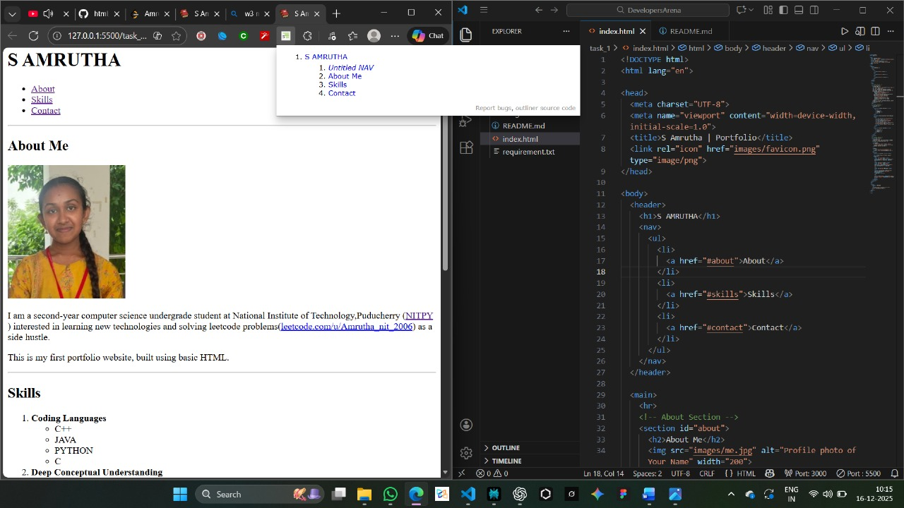

# S Amrutha – HTML Portfolio

- This is a simple one-page personal portfolio built using basic HTML5.  
- It is created for Task‑1 for the internship programme offered by The Developers Arena in the Web Development domain to learn the basics of HTML5 and understand the usage and importance of semantic tags, navigation, forms, and basic accessibility.

## Project Overview

- The page introduces me as a second-year Computer Science undergraduate at NIT Puducherry and showcases my skills and contact information.  
- Visitors can read a short bio, view my technical and spoken skills, and contact me using a form or through direct LinkedIn and email links.

## Visual Preview

*(Screenshot of the live portfolio page rendered in the browser.)*

## HTML Validation

The `index.html` file was validated using the W3C Markup Validation Service.  
The final version passes validation with no errors after fixing list nesting and minor structural issues.

## Features

- Semantic HTML5 layout using `header`,`nav`,`main`,`section`an`<footer`
- Internal navigation links to About, Skills, and Contact sections
- Skills section organised with an ordered list and nested unordered lists for sub-skills
- Contact section with:
  - Direct LinkedIn and email links
  - A form wrapped in a `fieldset` with `legend`
  - Client-side validation using `required`, `type="email"`, `autocomplete`, and `autofocus`
- External test endpoint (`https://httpbin.org`) used to inspect submitted form data
- Profile image with descriptive `alt` text
- Favicon linked via `<link rel="icon" href="images/favicon.png" type="image/png">`

## File Structure

task_1/
├── index.html # Main HTML portfolio page
├── README.md # Documentation and screenshots
├── requirement.txt # Optional file listing tools/requirements (if    needed)
└── images/ # All images used in the project
    ├── me.jpg # Profile photo shown in About section
    ├── favicon.png # Favicon displayed in the browser tab
    ├── result.jpg # Screenshot of W3C validation result
    └── preview.jpg # Screenshot of the live page

## How to Run

1. Download or clone this repository. 
2. Open `index.html` in any modern web browser, **or**  
   use the Live Server extension in VS Code:
   - Right-click `index.html` → “Open with Live Server”. 

## HTML Concepts Used

- Document structure: `<!DOCTYPE html>`, `<html lang="en">`, `<head>`, `<body>` 
- Metadata: `<meta charset>`, `<meta name="viewport">`, `<title>`, favicon `<link>` 
- Semantic layout elements: `header`, `nav`, `main`, `section`, `footer` - Text and inline elements: headings, paragraphs, `strong`, `abbr`, links (`a`) 
- Lists: ordered list (`ol`) with nested unordered lists (`ul`) for grouped skills 
- Images: `` with `src`, `alt`, and `width` 
- Links:
  - Internal anchors (`href="#about"`, `href="#skills"`, `href="#contact"`)   - External links (`target="_blank"`) to NITPY, LeetCode, LinkedIn and email (`mailto:`) 
- Forms:
  - `form` with `action`, `method`, `formaction`, and `formmethod` 
  - `label` and `input` pairs with `id` and `name`
  - `textarea` for multi-line messages
  - `button type="submit"` for sending the form 

## Testing and Validation

- All navigation links (About, Skills, Contact) were tested in the browser. 
- The contact form was tested using `https://httpbin.org/get` and `https://httpbin.org/post` to view submitted data. 
- `index.html` was checked with the W3C Markup Validation Service and corrected for list nesting and other issues. 

## Resources

- Dave Gray HTML Tutorials for Beginners(`https://youtube.com/playlist?list=PL0Zuz27SZ-6OlAwitnFUubtE93DO-l0vu&si=HXth0R2LWFiNVS1h`)
- httpbin.org for viewing test form submissions
- W3C Markup Validation Service for checking HTML validity