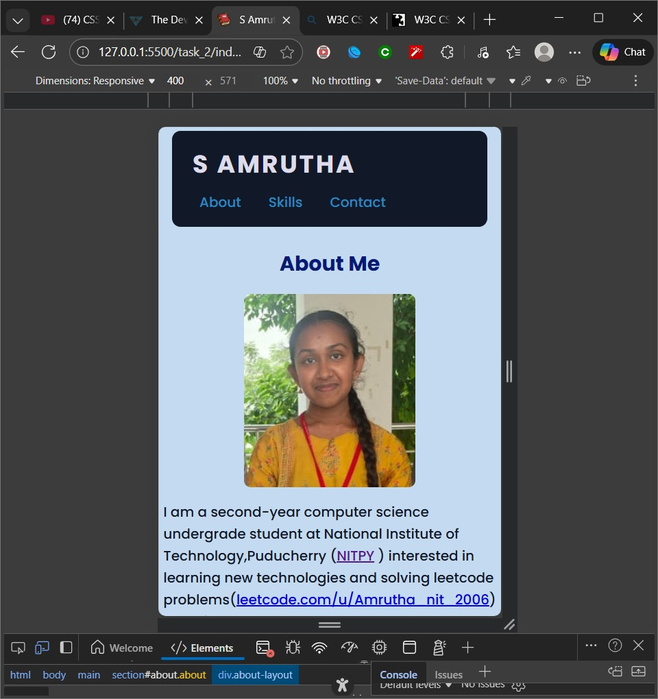
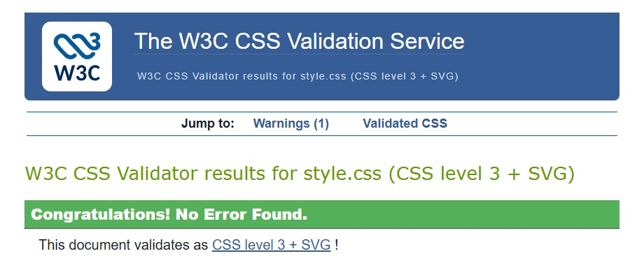

# S Amrutha – Styled HTML Portfolio (Task 2)

This project is a CSS-enhanced version of my basic HTML portfolio page.  
The goal is to practise modern CSS fundamentals: external stylesheets, color variables, Flexbox layout, hover effects, responsive design, and form styling.

## Project Overview

The page presents my personal portfolio with three main sections: About, Skills, and Contact.  
Task‑2 focuses on adding a consistent visual design and responsive layout using only CSS, without changing the core HTML structure from Task‑1.

Main CSS objectives:

- Create and link an external `style.css` file.
- Define a reusable color scheme using CSS variables.
- Use Flexbox for header, skills layout, and responsive behavior.
- Add hover effects to navigation links, buttons, and skill cards.
- Make the layout adapt well to mobile screens with media queries.
- Style the form and `<hr>` elements to match the overall theme.

## Setup Instructions

1. **Clone or download the repository**
   git clone https://github.com/Amrutha182006/Web-Development-Internship

2. **File Structure**
   task_2/
├── index.html # HTML structure (same content as Task 1, minor class additions)
├── style.css # All custom styles for Task 2
└── screenshot/
    ├── preview-mobile.jpeg # Screenshot of mobile view
    ├── desktop-mobile.jpeg # Screenshot of mobile view
    ├── css_validated.jpeg # Screenshot of mobile view
└── images/
    ├── me.jpg # Profile photo
    ├── favicon.png # Favicon icon
    ├── preview.jpg # Screenshot of final page (desktop)
    ├── result.html.jpg # HTML validation screenshot
└── README.md


3. **Run locally**

- Open `index.html` directly in a browser **or**  
- Use the Live Server extension in VS Code and choose **“Open with Live Server”** on `index.html`.

No build tools or package managers are required; plain HTML and CSS are enough.

## Code Structure

- **Reset and base styles**
- Global reset using `*`, `*::before`, `*::after` to remove default margins/padding and set `box-sizing: border-box`.
- `body` defines the main font stack, line-height, base background, and text color.

- **Color scheme and typography**
- `:root` defines CSS custom properties:

 ```
 :root {
   --primary-color: #2563eb;
   --secondary-color: #111827;
   --accent-color: #10b981;
   --bg-color: #c4daf0;
 }
 ```

- **Layout containers**
- `header, main, footer` share `max-width` and centered layout via `margin: 0 auto;`.

- **Header and navigation (Flexbox)**
- `header` uses `display: flex; justify-content: space-between; align-items: center;`.
- `nav ul` uses Flexbox with horizontal gap between links.
- Links have hover styles and smooth color transitions.

- **About section**
- `.about` centers the section heading.
- `.about-layout` uses Flexbox for vertical column layout on desktop, switching to a mobile-friendly stack in the media query.

- **Skills section**
- `.skills` centers the overall section and heading.
- `.skills-grid` uses Flexbox to place `.skill-card` boxes side by side, wrapping on smaller screens.
- `.skill-card` provides “branch” boxes with consistent sizing, background, shadow, and hover elevation.

- **Contact form**
- `fieldset`, `legend`, `label`, `input`, `textarea`, and `button` are styled for clear grouping and good spacing.
- Buttons have hover and slight movement for interactivity.
- Extra “stitched” effect is added to `fieldset` using dashed borders and box shadows.

- **Horizontal rules**
- `hr` is styled with a gradient background to visually separate sections.

- **Footer**
- Simple centered footer with top border, smaller text, and link hover underline.

- **Responsive design**
- A media query at `max-width: 640px`:
 - stacks header content vertically,
 - allows navigation items to wrap,
 - adjusts padding,
 - simplifies the About layout for small screens.

## Visual Documentation

### Layout and Styling

- **Desktop view**


- **Mobile / small-screen view**



### Validation

- **CSS validation**



`style.css` passes the W3C CSS validator as CSS Level 3 + SVG with no errors.


## Technical Details

Although this is a small project, it uses several core CSS “building blocks” and patterns:

- **Selectors used**
- Element selectors: `body`, `header`, `section`, `h2`, `hr`, `button`, `footer`, `fieldset`, `label`, `input`, `textarea`.
- Class selectors: `.about`, `.about-layout`, `.skills`, `.skills-grid`, `.skill-card`.
- Pseudo-elements in the reset: `*::before`, `*::after`.
- Pseudo-classes: `a:hover`, `button:hover`, `.skill-card:hover`.

- **Layout techniques**
- Flexbox coordinates horizontal/vertical alignment in `header`, `.skills-grid`, and `.about-layout`.
- Centered content area using `max-width` + `margin: 0 auto`.

- **Design system**
- Color palette defined in `:root` for easy reuse and consistent theming across header, buttons, and cards.
- Global typographic rules for body text and headings.

- **Interactivity**
- Hover states for nav links, buttons, and skill cards using `transition`, `transform`, and color changes.
- Smooth scrolling enabled through `html { scroll-behavior: smooth; }`.

- **Responsive behavior**
- Media query ensures the layout adapts for mobile devices without separate HTML.

## Testing Evidence

Manual tests performed:

- **Visual inspections**
- Checked layout and alignment in desktop view and mobile simulator (DevTools).
- Verified that hover effects activate on nav links, skill cards, and the Send button.

- **Functional checks**
- All navigation links (`About`, `Skills`, `Contact`) scroll to the correct section anchors.
- Contact form fields enforce basic validation (`required`, email format).
- Form submits to the test endpoints (`https://httpbin.org/get` and `https://httpbin.org/post`) to confirm field names and values are sent correctly.

- **Validation**
- `index.html` validated with W3C HTML Markup Validation Service (no errors).
- `style.css` validated with W3C CSS Validation Service (no errors, 1 minor informational warning only regarding the usage of google font).

