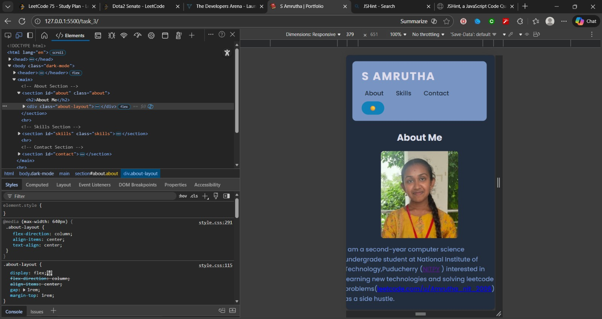
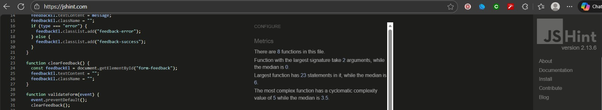

# S Amrutha – Interactive Portfolio with JavaScript (Task 3)

This project adds JavaScript interactivity to the styled HTML/CSS portfolio from Task-2.  
The goal is to demonstrate DOM manipulation, event handling, form validation, and three interactive features using vanilla JavaScript.

## I. Project Overview

The portfolio now includes client-side form validation, dark mode toggle with localStorage persistence, live greeting/time display, and image lightbox zoom.  
Task-3 focuses on adding dynamic behavior without external libraries, using event listeners, DOM updates, and reusable functions.

**Main JavaScript objectives:**
- Create and link external `script.js` file
- Implement form validation with real-time error/success messages
- Add dark mode toggle with localStorage to save user preference
- Display live greeting and current time that updates every second
- Create image lightbox zoom effect on profile photo click
- Use event listeners for form submit, button clicks, and DOMContentLoaded

## II. Setup Instructions

**1. Clone or download the repository:**
git clone https://github.com/Amrutha182006/Web-Development-Internship

**2. File structure:**
task_3/
├── index.html – HTML structure with added IDs/classes for JS
├── style.css – CSS from Task-2 with dark mode support
├── script.js – All JavaScript interactivity
├── screenshot/
│ ├── desktop-view.jpeg – Desktop view with all features
│ ├── mobile-view.jpeg – Mobile responsive view
│ └── validated.jpeg – Form error/success messages
└── images/
├── me.jpg – Profile photo (click to zoom)
└── favicon.png – Favicon icon

**3. Run locally:**
- Open `index.html` in a browser, or
- Use Live Server extension in VS Code ("Open with Live Server")

## III. Code Structure

**JavaScript (script.js)**

**Helper functions:**
- `showFeedback(message, type)` – displays error/success messages below form
- `clearFeedback()` – removes validation messages
- `toggleDarkMode()` – switches theme and saves to localStorage
- `loadDarkModePreference()` – restores saved theme on page load
- `updateGreeting()` – generates live greeting + time display

**Form validation:**
- `validateForm(event)` – checks name (≥2 chars), email (@+.), message (≥10 chars)
- Prevents submission on errors, focuses invalid field, shows feedback
- Submits to httpbin.org after 500ms success delay

**Interactive features:**
1. Form validation with live error/success messages (DOM updates)
2. Dark mode toggle (🌙/☀️ icon in header) with localStorage persistence
3. Live greeting + current time (updates every second via setInterval)
4. Image lightbox zoom (click profile photo for fullscreen overlay)

**Event handling:**
- `DOMContentLoaded` – initializes all listeners and features
- form submit – triggers `validateForm`
- dark-toggle click – triggers `toggleDarkMode`
- profile image click – opens lightbox overlay

## IV. Visual Documentation

**Desktop view with all interactive features visible:**

**Mobile responsive layout with dark mode toggle:**

**Form Validation Demo:**

## V. Technical Details

**DOM Manipulation:**
- `getElementById`, `querySelector` for element access
- `textContent`, `classList.add/remove/toggle` for content/style updates
- `createElement`, `appendChild/removeChild` for lightbox overlay

**Event Handling:**
- `addEventListener` for submit, click, DOMContentLoaded
- `event.preventDefault()` blocks default form submission
- `event.target` for form and image handling

**Data Persistence:**
- `localStorage.setItem/getItem` saves dark mode preference
- Automatically restores on page reload

**Reusable Functions:**
- `showFeedback/clearFeedback` handle all form messaging
- `toggleDarkMode/loadDarkModePreference` manage theme state
- `updateGreeting` generates dynamic time-based content

**Interactive Features (3+ required):**
1. Form validation – real-time error messages + field focus
2. Dark mode toggle – persistent theme switching with icon change
3. Live time – updates every second based on current hour

## VI. Testing Evidence

**Functional tests:**
- Form validation: tested invalid name (<2 chars), bad email, short message
- Dark mode: toggles on/off, persists across refreshes via localStorage
- Live greeting: updates every second, changes morning/afternoon/evening

**Visual inspections:**
- All features tested in desktop Chrome/Edge and mobile DevTools emulator
- Hover states, transitions, and responsive behavior confirmed

**Browser compatibility:**
- Tested in Chrome, Edge, Firefox – vanilla JS, no dependencies
- Mobile touch events work for lightbox and dark mode toggle

**Validation:**
- `index.html` – W3C HTML validator (no errors)
- `style.css` – W3C CSS validator (CSS3 + SVG, 1 Google Fonts warning)
- `script.js` – JSHint validated (0 errors, minor style warnings)
