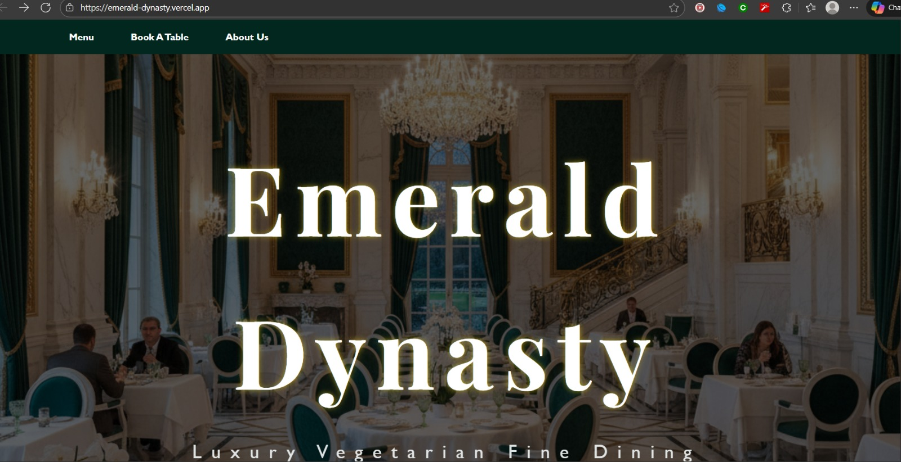
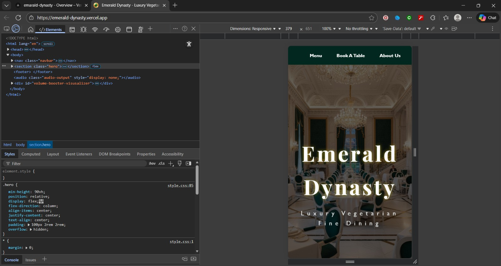
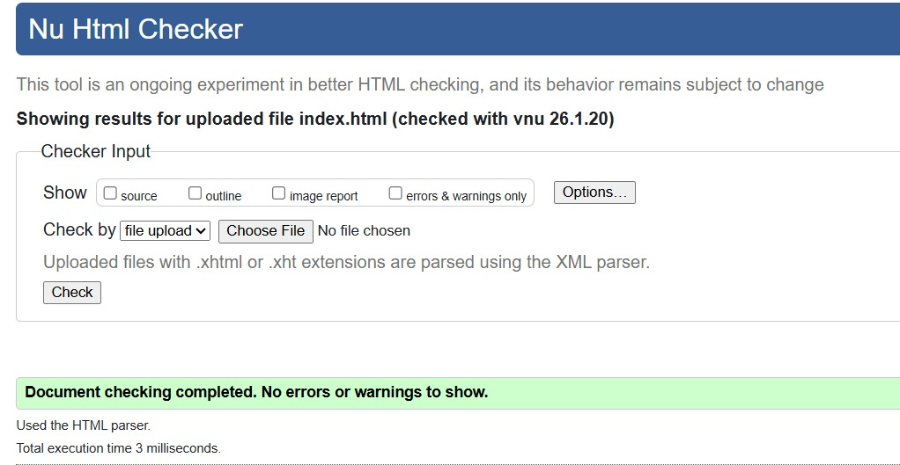
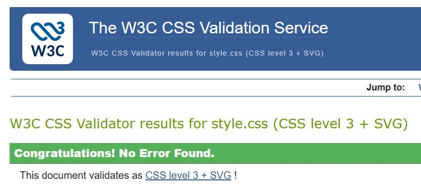

# S Amrutha – Emerald Dynasty Restaurant Interface (Task 4)

This project adds JavaScript interactivity to the **Emerald Dynasty** luxury restaurant interface. The goal is to demonstrate **DOM manipulation**, **advanced CSS styling (Glassmorphism)**, **form validation**, and **interactive seating selections** using **vanilla JavaScript**.

---

# I. Project Overview

The Emerald Dynasty interface now includes **client-side form validation** for reservations, a sophisticated **glassmorphic “sugary glaze” UI**, and **interactive seating cards**. Task 3 focuses on creating a **premium user experience** without external libraries, using event listeners for selection states and form handling.

## Main JavaScript Objectives

* Implement seating selection logic with real-time visual feedback
* Implement form validation with real-time error messages for booking
* Use event listeners for radio button changes and form submission
* Manage glassmorphic UI states using dynamic class toggling
* Ensure responsive behavior for interactive elements across all devices

---

# II. Setup Instructions

## 1. Clone or Download the Repository or Access through direct link

git clone https://github.com/Amrutha182006/emerald-dynasty

deployed link https://web-development-internship.vercel.app/index.html

## 2. File Structure

```
task-4/
├── index.html        – Landing page with semantic structure
├── menu.html         – Restaurant menu display
├── about.html        – Heritage and philosophy with blurred background
├── contact.html      – Reservation form with glassmorphic styling
├── css/
│   ├── style.css     – Global navigation and footer styles
│   └── contact.css   – Glassmorphism and interactive card styles
│   └── about.css     – Blurred background for better readability
│   └── menu.css      – Different cards for each food type
├── js/
│   └── m.js     – Spining plate interaction
└── images/
    ├── ptrn.png – Background pattern
    ├── ty.jpeg – Menu / food image
    ├── tyoe_3.png – Menu category image
    ├── type_4.png – Menu category image
    ├── type_2.png – Menu category image
    ├── tables.png – Table / seating illustration
    ├── bg.png – Background image
    ├── drinks.png – Drinks menu image
    ├── starters.png – Starters menu image
    ├── desserts.png – Desserts menu image
    ├── mains.png – Main course menu image
    ├── food1.png – Food showcase image
    └── icon1.png – UI icon asset  – Background pattern for About section
    └── screenshot/
        ├── dk-view.jpeg – Desktop view with glassmorphism
        ├── mb-view.jpeg  – Mobile responsive view
        ├── css-valid.jpeg    
        └── html-valid.jpeg    
```

## 3. Run Locally

* Open `index.html` directly in a browser, **or**
* Use **Live Server** extension in VS Code

---

# III. Code Structure

## JavaScript (`script.js`)

### Helper Functions

* **updateSelection(card)**
  Highlights the selected seating card and dims others

* **showFormError(message)**
  Displays validation alerts above the submit button

* **clearValidation()**
  Resets input borders to the default *ivory* state

### Form Validation

* **validateBooking(event)**

  * Checks name (required)
  * Ensures selected date is in the future
  * Confirms seating option selection

* Prevents form submission on errors

* Highlights empty or invalid fields

* Logs confirmed data to the console to simulate successful submission

### Interactive Features

* **Interactive Seating Cards**
  Radio inputs are linked to visual cards that scale and glow upon selection

* **Glassmorphic Form**
  A *sugary glaze* effect using `backdrop-filter` and transparency for a premium look

* **Blurred Background Layering**
  The About section uses `::before` pseudo-elements to blur backgrounds without affecting text clarity

### Event Handling

* **DOMContentLoaded** – Initializes reservation form listeners
* **change event** – Updates seating card UI state

---

# IV. Visual Documentation

## Desktop View


## Mobile Responsive View


---

# V. Technical Details

## DOM Manipulation

* `querySelector()` and `querySelectorAll()` for form elements and cards
* `style.borderColor` and `classList` for live validation feedback
* `parentElement` traversal to apply selected styles

## Event Handling

* `event.preventDefault()` for JavaScript-controlled validation
* `window.addEventListener('scroll')` *(if used)* for navbar transitions

## CSS Architecture

* **Glassmorphism**
  `rgba(255, 255, 255, 0.1)` with `backdrop-filter: blur(15px)`

* **Grid Layout**
  Used for seating cards and form alignment

* **Pseudo-elements**

  * `::after` for animated navbar underline
  * `::before` for background blur layers

## Interactive Enhancements

* Real-time scaling and glow effects via CSS transitions
* Dynamic validation feedback on user interaction

---

# VI. Testing Evidence

## Functional Tests

* Form validation tested for:

  * Empty name
  * Past dates
  * Missing seating selection

* Navigation links verified across all pages

* Responsive grid tested from desktop to mobile layouts

## Visual Inspection

* Backdrop-filter verified in Chrome and Edge
* Safari fallback tested
* Navbar alignment confirmed at 1920px and 1200px widths
* Footer consistency verified on all pages

## Browser Compatibility

* Tested in **Chrome**, **Edge**, and **Firefox**
* Responsive behavior confirmed using Chrome DevTools mobile emulator

## Validation Results

* `index.html` – W3C HTML Validator: **Passed**
* `style.css` – W3C CSS Validator: **Passed**
